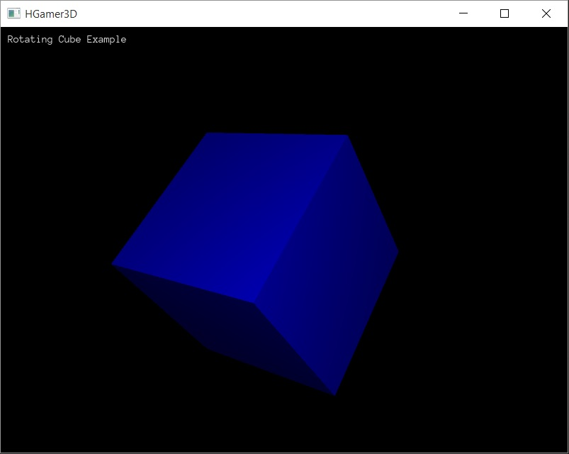

Start Programming
#################

You are sitting in front of your computer, the fancy GUI showing a Web-Browser and what next? How to start?

To program a game, you will need a lot of tools. You will need a compiler, which translates program source code into a runnable executable. 
You will also need something to edit your program files with, an editor and a kind of command center from which to coordinate all activities.
Typically the command center can be a so called IDE (integrated development environment) or you also can simply use the `command line`_, typing
in commands in a terminal-like window. You will need libraries for graphics, sound, joystick or keyboard input and so on. Those libraries are
mostly referred to as "game engine". And you need media, the graphics, sounds and similar artefacts, which build the game content.

|HGamer3D| makes it easy to setup the basic tools for a fast start. Follow the steps below, to create a first game from an existing project 
template. 

**Create Directory With Tooling**

Please create a new directory either in the explorer of your OS or with the command line. Then download the tools from the following links:

* `Windows Tools Download`_
* `Mac Tools Download`_
* `Linux Tools Download`_

.. _`Windows Tools Download`: http://www.hgamer3d.org/downloads/HGamer3D-Haskell-Windows-0.8.zip
.. _`Mac Tools Download`: http://www.hgamer3d.org/downloads/HGamer3D-Haskell-Mac-0.8.tar.gz
.. _`Linux Tools Download`: http://www.hgamer3d.org/downloads/HGamer3D-Haskell-Linux-0.8.tar.gz
.. _`command line`: HowTo.html
.. _`more details about arriccio`: Arriccio.html

Move or copy the downloaded zip-file to the new directory and extract the content there. Finally, start a `command line`_ and cd into the freshly created directory with the tools.

**Build and run the example game**

If you list your directory content now, you see a number of files needed for your first game project and some batch files, providing you the neccessary commands to start programming. The example game project consist of the game source code, the ``game.hs`` file. Files giving instructions
to the compiler, how to compile the game (``game.cabal``, ``stack.yaml``) and some auxiliary files.

The following batch files provide the functionality listed in the table below:

================ ================================= ==================================================
Cmd/Batch        Function                          Parameters
================ ================================= ==================================================
``install``      installs Haskell                  none
``edit``         opens an editor window            files to open, for example "edit game.hs"
``build``        runs the Haskell compiler         none, uses game.hs
``run``          starts the compiled program       none, uses game.exe
================ ================================= ==================================================

You first need to install the Haskell compiler by typing ``install`` (and pressing ``Enter``). After having accomplished this you can go right ahead and build and run your first program by issuing the ``build`` and then then the ``run`` command.

A spinning 3D cube should show up in a HGamer3D program window. Congratulations! You just managed to get your first Haskell game programe
to compile and run on your own device. Of course this was still an existing example program. But now you have all the tools available
to start your own experiments with Haskell and 3D game programming.

.. note:: You might have noticed, that the batch files use a program in the ``tools`` folder called ``aio``. This executable downloads all components needed and also runs them (`more details about arriccio`_).

**Examining the Code**

If you want to have a first preview into a functioning code snippet fire up the editor and have a look at the code with ``edit game.hs``.

Do you recognize the typical Haskell program structure? The ``Main`` module declaration and imports at the beginning, a function called ``gameLogic`` and one called ``main``? Try to modify this code in the editor, for example, change the color to green, re-compile the code with ``build`` and run it with ``run``. 

.. code-block:: haskell

	{-# LANGUAGE OverloadedStrings #-}
	module Main where

	import HGamer3D

	import qualified Data.Text as T
	import Control.Concurrent
	import Control.Monad
	import System.Exit

	gameLogic hg3d = do

	    -- create minimum elements, like a camera
	    eCam <- newE hg3d [
	        ctCamera #: FullViewCamera,
	        ctPosition #: Vec3 1 1 (-30.0),
	        ctLight #: Light PointLight 1.0 1000.0 1.0 
	        ]

	    -- do something interesting here, in this example case, it is a text and
	    -- a rotating cube

	    eText <- newE hg3d [
	        ctText #: "Rotating Cube Example",
	        ctScreenRect #: Rectangle 10 10 100 25
	        ]

	    eGeo <- newE hg3d [
	        ctGeometry #: ShapeGeometry Cube,
	        ctMaterial #: matBlue,
	        ctScale #: Vec3 10.0 10.0 10.0,
	        ctPosition #: Vec3 0.0 0.0 0.0,
	        ctOrientation #: unitU
	        ]

	    let rotateCube = do
	            forever $ do 
	                updateC eGeo ctOrientation (\u -> (rotU vec3Z 0.02) .*. u)
	                updateC eGeo ctOrientation (\u -> (rotU vec3X 0.015) .*. u)
	                sleepFor (msecT 12)

	    forkIO rotateCube
	    return ()

	main = do 
	    runGame standardGraphics3DConfig gameLogic (msecT 20)
	    return ()

.. include:: GeneralInclusions
