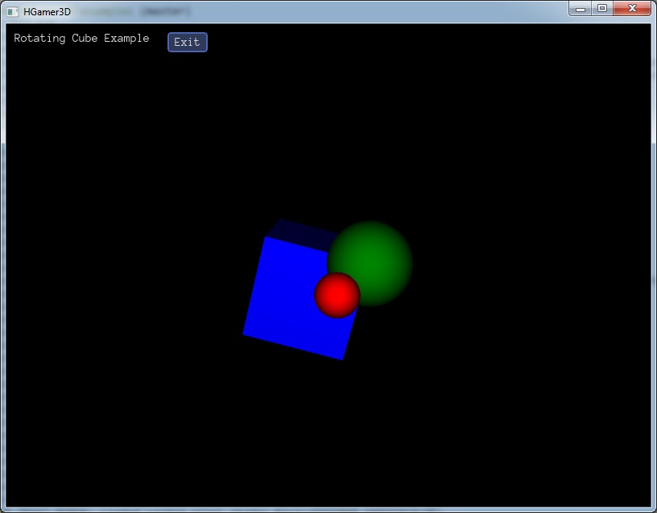

Start Programming
#################

The purpose of this chapter is showing you how to setup |HGamer3D| on your platform and to start compiling and running a first example game. Usually this is a complex endeavour since the combination of Haskell and C++ technologies gives some hurdles to the user. To circumvent that I separated the different pieces in independent components and created a tool, which downloads them and starts them, according to some meta-information contained in a toml file. All this happens behind the scenes, if you follow the instructions below. To make it transparent, I will start with a small introduction to the `aio` tool.

The aio Tool
--------------

There is a more detailed explanation to the tool `here`_ . To summarize, what `aio` is doing and also what it is not doing:

`aio` does the following:

- reading a toml meta-file, given by a URL, downloading dependencies into $HOME/.aio, running commands from there
- checking, if the downloaded data is properly signed by a ssh key
- asking before download of each component for allowance, giving component name, purpose, license and signing key information
- setting environment variables to facilitate dependency injection between components, only for the environment of the running program

`aio` is not doing anything of the following things:

- does not download anything into a different folder
- does not modify the Windows registry or similar databases
- does not download any components, which have not been announced before
- does not download components, which are not properly signed

You can check the source code of `aio` in the public `github repository`_

.. _`github repository`: https://github.com/urs-of-the-backwoods/fresco/blob/master/arriccio/main.go
.. _`here`: Arriccio.html

Setup of HGamer3D
-----------------

To setup everything needed for compiling |HGamer3D| programs, follow the instructions below:

**Install aio**

Get the binaries of `aio` by either downloading the `tar.gz` file, or by cloning the installer repo from GitHub:

*  `aio tools download`_
*  `aio github site`_

As a second step cd into the folder of your operating system (Linux, Windows, Mac supported) and run the batch file. Please check, if ``aio`` is in your path afterwards, this is needed. If the batch file did not succeed, placing *aio* into your path, you need to do this manually by yourself.

.. _`aio tools download`: http://www.hgamer3d.org/downloads/aio-installer-1217.tar.gz
.. _`aio github site`: https://github.com/urs-of-the-backwoods/aio-installer

**Install HGamer3D Client Tools**

As described above, *aio* is just a command, to download dependent libraries, media and tools. You now can use it, to setup the commands, you will use for creating, compiling and running |HGamer3D| code.

Please issue the following command, which will create some aio alias commands for the next steps and which installs Stack and GHC, the Haskell tools:

.. code-block:: console

  aio http://www.hgamer3d.org/tools/Install.1217 install

This should end up with a message that GHC is now available, locally. In addition some alias are setup, which you can check with the ``aio list alias`` command. 

**Scaffold, Build and Run Project**

Now everything is ready to go, follow the final steps to create a sample project, compile and run it:

.. code-block:: console

  aio Create GameProject
  cd GameProject
  aio Stack install --local-bin-path .	
  aio Run ./game

On the Windows platform, you need to modify the last command to ``aio Run game.exe``. 

Done.

|

|

**Examining the Code**

If you want to have a first preview into a functioning code snippet fire up the editor and have a look at the code with ``aio Edit game.hs``.

Do you recognize the typical Haskell program structure? The ``Main`` module declaration and imports at the beginning, a function called ``gameLogic`` and one called ``main``? Try to modify this code in the editor, for example, change the color to green, re-compile the code with ``aio Stack install --local-bin-path .`` and run it with ``aio Run ./game``. 

.. literalinclude:: ../../HGamer3D/samples/RotatingCube2.hs
    :language: Haskell

.. include:: GeneralInclusions
