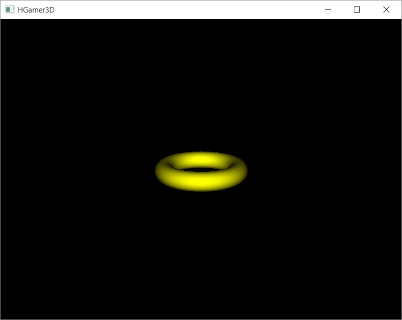
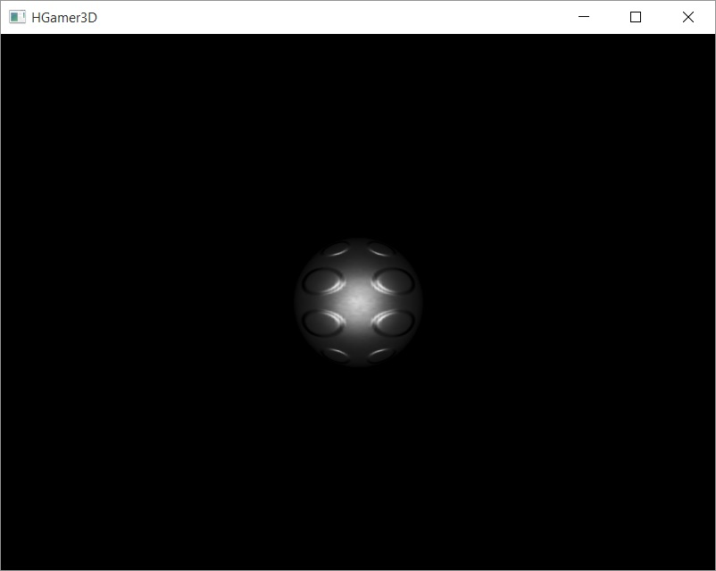

Geometries
##########

The example programs can be used as a good starting point for own experiments with Haskell. Details will be explained later, but the following code gives
a good base for trying some basic concepts. In this chapter, we will create cubes, spheres and similar examples of geometries.

**Starting Framework for Own Experiments**

Copy below code in game.hs and use it for the following sections of this chapter. Between start and end of experimental area comments, you might
add elements, you can see in the HGamer3D window. Position them at 0, 0, 0 (see next chapter on coordinates). Compile the program and run it.
Since the code below does not contain anything visible, the screen will be empty!

.. code-block:: haskell

    {-# LANGUAGE OverloadedStrings #-}
    module Main where

    import HGamer3D

    import qualified Data.Text as T
    import Control.Concurrent
    import Control.Monad
    import System.Exit

    gameLogic hg3d = do

        -- create minimum elements, you will need, a camera and a light
        eCam <- newE hg3d [
            ctCamera #: FullViewCamera,
            ctPosition #: Vec3 0 0 (-5.0),
            ctLight #: Light PointLight 3.0 1000.0 1.0
            ]

        -- start of experimental area, from this line down, you can add elements, positioned at 0, 0, 0

        -- end of experimental area

        return () -- close do block

    -- main program, running gameLogic with standard configuration
    main = do 
        runGame standardGraphics3DConfig gameLogic (msecT 20)
        return ()

**Adding a Torus**

Now let's add a Torus, please put the following code in the exprimental area, and you will get a cube.

.. code-block:: haskell

        -- start of experimental area, from this line down, you can add elements, positioned at 0, 0, 0

        eGeo <- newE hg3d [
            ctGeometry #: ShapeGeometry Torus,
            ctOrientation #: (rotU vec3X (-0.3)),
            ctMaterial #: matYellow
            ]

        -- end of experimental area

After compiling this, you will get a yellow torus. The API to achieve that is almost self-explanatory. A new entity is created by the function
``newE``. This function takes as input a list of property - value pairs and creates as output a reference to the entity. Since 
it will be also put directly on the drawing screen the function is in the IO monad, since it has an effect and changes state in the system somewhere.
The properties given in this example are the type of geometry ``ShapeGeometry Torus`` the orientation, given as a rotation around x-axis ``rotU vec3X (-0.3)``
and the material ``matYellow``.

|

**Creating a Metalic Sphere**

Simply change the paramters to other values, if you want to modify the geometry. The following code yields a metalic sphere.

.. code-block:: haskell

        -- start of experimental area, from this line down, you can add elements, positioned at 0, 0, 0

        eGeo <- newE hg3d [
            ctGeometry #: ShapeGeometry Sphere,
            ctMaterial #: matMetalBumps
            ]

        -- end of experimental area

|

**Rotating the Sphere**

To modify something, two functions exist in |HGamer3D|. One for setting value and one for updating values. There is also a function, to read 
value without changing them. All functions take the reference to the entity as first value and the component on which the action takes place
as a second parameter. The entity reference is the return value of the newE function, which creates them. The component type is the 
first part of the property value pair in the creation list, so for example ``ctGeometry`` or ``ctMaterial``.

==================== =============================================== ========================================= ===========================
function             what the function does                          parameters                                return value
==================== =============================================== ========================================= ===========================
readC                gets one component from entity                  entity component-type                     value
setC                 sets the value of a component in entity         entity component-type value               old value
updateC              updates value of component with function        entity component-type update-function     old value
==================== =============================================== ========================================= ===========================

In the example below, we rotate the sphere by updating its orientation component with an update function
which increases the angle of rotation in each loop.

.. code-block:: haskell

    -- start of experimental area, from this line down, you can add elements, positioned at 0, 0, 0

    eGeo <- newE hg3d [
        ctGeometry #: ShapeGeometry Sphere,
        ctMaterial #: matMetalBumps,
        ctOrientation #: (rotU vec3X (-0.3))
        ]

    let rotate = do
            updateC eGeo ctOrientation (\o -> (rotU vec3Z 0.05) .*. o)
            sleepFor (msecT 30)
            rotate
    forkIO rotate

    -- end of experimental area

.. include:: GeneralInclusions
