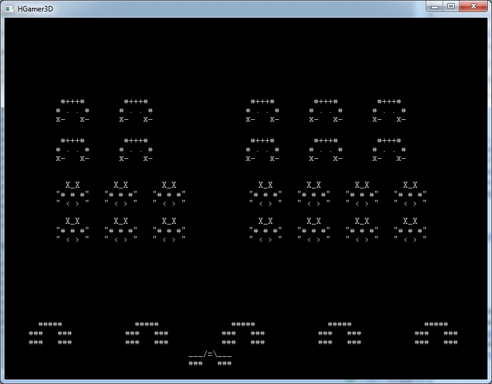

The Code - Space Invaders 2D
############################

And here the final game is presented. Are you sure you want to see it, did you try yourself? First a teaser picture.

|

|

Nice, isn't it. 

Walk Through
------------

**The Main Routine**

The main routine is starting the |HGamer3D| framework, starting the music and creating the 
game assets. What follows is the creation of some variables for communication between 
threads and 6 independent threads moving actors, receiving key-presses, shooting bullets, 
calculating collisions and checking for the game end condition. "forkIO" is actually creating
a new thread.

"makeVar" is from the |HGamer3D| library and it creates a "variable", which holds a modifiable piece of
data. It is possible to access this data thread safe via readVar and updateVar. The latter updates
the content of a variable atomically.

.. code-block:: Haskell

	main = do
	  hg3d <- configureHG3D
	  music
	  (ping, clash) <- sounds
	  
	  (canon : boulders) <- createActors canonBouldersData
	  invaders <- createActors invaderData
	  
	  varInvaders <- makeVar invaders
	  varMoveState <- makeVar NotMoving
	  varNumShots <- makeVar 0
	  varShots <- makeVar []
	  varEnd <- makeVar 0

	  installKeyHandler hg3d varMoveState varNumShots
	  
	  forkIO (canonLoop canon varShots varMoveState varNumShots)
	  forkIO (shotsLoop varShots)
	  forkIO (invadersLoop varInvaders True 0 varEnd)
	  forkIO (collisionLoop varInvaders varShots varEnd boulders ping clash)
	  forkIO (handleEnd hg3d varEnd)
	  
	  loopHG3D hg3d (msecT 30) (return True)

**The Graphics**

All the artwork is defined in the arts data structure, which is a map from actor type to text. It is painted on 
the screen with a text entity element in the createActor routine. The "newE" call creates a |HGamer3D| entity
with a text and rectangle component. Those components can be read, set and modified indepedently.

.. code-block:: Haskell

	arts :: M.Map ActorType (T.Text, T.Text, Int, Int)
	arts = M.fromList [ 
	  (Canon, ("___/=\\___\n###   ###", "", 76, 30)),
	  (Boulder, ("  #####\n###   ###\n###   ###", "", 70, 45)), 
	  (Invader 1, ("  X_X\n\"# # #\"\n\" < > \"", "\" X_X \"\n\"# # #\"\n  > <", 54, 45)),
	  (Invader 2, ("   ___\n ++###++\n##__#__##\n X  =  X", "  ___\n ++###++\n++__#__++\n L  =  L", 70, 60)),
	  (Invader 3, (" #+++#\n# . . #\nx-   x-", " #+++#\n# . . #\n-x   -x", 54, 45)),
	  (Shot, ("\"\"", "", 14, 4))
	  ]

	createActor :: ActorType -> Int -> Int -> IO Actor
	createActor atype x y = do
	  let (t, _, w, h) = fromJust (M.lookup atype arts)
	  e <- newE [ ctText #: t, ctScreenRect #: Rectangle x y w h]
	  return $ Actor atype e

**Key Input**

Key input utilizes another variable pair. The raw key events are captured by an input event handler, which is 
connected to a callback via the "registerCallback" method. The callback function sets the state of the 
varMoveState and varNumShots variables. Those variables are then queried in the functions checking for
key-directions and key presses for bullet generation.

.. code-block:: Haskell

	data CanonMove = NotMoving | MovingRight | MovingLeft
	     deriving (Show)

	handleKey k (varMoveState, varNumShots) = 
	  case k of
	    (KeyDown _ _ "Right") -> writeVar varMoveState MovingRight >> return ()
	    (KeyUp _ _ "Right") -> writeVar varMoveState NotMoving >> return ()
	    (KeyDown _ _ "Left") -> writeVar varMoveState MovingLeft >> return ()
	    (KeyUp _ _ "Left") -> writeVar varMoveState NotMoving >> return ()
	    (KeyDown _ _ "Space") -> updateVar varNumShots (\n -> (n + 1, ()))
	    _ -> return ()

	installKeyHandler hg3d varMoveState varNumShots = do
	  ieh <- newE [ctInputEventHandler #: DefaultEventHandler, ctKeyEvent #: NoKeyEvent]
	  registerCallback hg3d ieh ctKeyEvent (\k -> handleKey k (varMoveState, varNumShots))

**Game Functionality**

From those interactions the "loop" functions create the game logic by defining the actions for 
the moving canon, the moving invaders, the flying bullets and the collision detection. The 
collision loop is the most complex ones it also acts upon a detected collision and removes
bullets and invaders from their lists to kill them.

Code
----

.. code-block:: Haskell
	:linenos:

	{-# LANGUAGE OverloadedStrings #-}
	module Main where
	import HGamer3D

	import Control.Concurrent
	import Control.Monad
	import qualified Data.Map as M
	import qualified Data.Text as T
	import Data.Maybe

	-- pure data definitions
	-- ---------------------

	data ActorType = Canon | Boulder | Invader Int | Shot deriving (Eq, Show, Ord)

	arts :: M.Map ActorType (T.Text, T.Text, Int, Int)
	arts = M.fromList [ 
	  (Canon, ("___/=\\___\n###   ###", "", 76, 30)),
	  (Boulder, ("  #####\n###   ###\n###   ###", "", 70, 45)), 
	  (Invader 1, ("  X_X\n\"# # #\"\n\" < > \"", "\" X_X \"\n\"# # #\"\n  > <", 54, 45)),
	  (Invader 2, ("   ___\n ++###++\n##__#__##\n X  =  X", "  ___\n ++###++\n++__#__++\n L  =  L", 70, 60)),
	  (Invader 3, (" #+++#\n# . . #\nx-   x-", " #+++#\n# . . #\n-x   -x", 54, 45)),
	  (Shot, ("\"\"", "", 14, 4))
	  ]

	instance Show Entity where
	  show e = "Entity: "
	  
	data Actor = Actor ActorType Entity deriving (Eq, Show)

	canonBouldersData :: [(ActorType, Int, Int)]
	canonBouldersData = [
	  -- canon
	  (Canon, 100, 550),

	  -- boulders
	  (Boulder, 40, 500),
	  (Boulder, 200, 500),
	  (Boulder, 360, 500),
	  (Boulder, 520, 500),
	  (Boulder, 680, 500)
	  ]
	  
	invaderData :: [(ActorType, Int, Int)]
	invaderData = [
	  -- invaders 1
	  ((Invader 1), 10, 210),
	  ((Invader 1), 90, 210),
	  ((Invader 1), 170, 210),
	  ((Invader 1), 250, 210),
	  ((Invader 1), 330, 210),
	  ((Invader 1), 410, 210),
	  ((Invader 1), 490, 210),
	  ((Invader 1), 570, 210),
	  
	  ((Invader 1), 10, 150),
	  ((Invader 1), 90, 150),
	  ((Invader 1), 170, 150),
	  ((Invader 1), 250, 150),
	  ((Invader 1), 330, 150),
	  ((Invader 1), 410, 150),
	  ((Invader 1), 490, 150),
	  ((Invader 1), 570, 150),
	  
	  -- invaders 2
	  
	  ((Invader 3), 10, 10),
	  ((Invader 3), 115, 10),
	  ((Invader 3), 220, 10),
	  ((Invader 3), 325, 10),
	  ((Invader 3), 430, 10),
	  ((Invader 3), 535, 10),
	  
	  ((Invader 3), 10, 75),
	  ((Invader 3), 115, 75),
	  ((Invader 3), 220, 75),
	  ((Invader 3), 325, 75),
	  ((Invader 3), 430, 75),
	  ((Invader 3), 535, 75)
	  ]

	-- actors and collisions
	------------------------

	createActor :: ActorType -> Int -> Int -> IO Actor
	createActor atype x y = do
	  let (t, _, w, h) = fromJust (M.lookup atype arts)
	  e <- newE [ ctText #: t, ctScreenRect #: Rectangle x y w h]
	  return $ Actor atype e
	                
	createActors actorData = mapM (\(a, x, y) -> createActor a x y) actorData

	posActor (Actor _ e) = readC e ctScreenRect >>= \(Rectangle x y _ _) -> return (x, y)
	moveActor (Actor _ e) (x, y) = updateC e ctScreenRect (\(Rectangle a b c d) -> (Rectangle (a+x) (b+y) c d))
	swapPic (Actor atype e) = do
	  let (t1, t2, w, h) = fromJust (M.lookup atype arts)
	  oldt <- readC e ctText
	  if oldt == t1 
	    then setC e ctText t2 >> return ()
	    else setC e ctText t1 >> return ()

	hit (Rectangle x y w h) (Rectangle x' y' w' h') = (not (x > x' + w' || x' > x + w)) && (not (y > y' + h' || y' > y + h)) 

	getCollisions :: Actor -> [Actor] -> IO [Actor]
	getCollisions (Actor a e) actors = 
	  mapM (\(a'@(Actor _ e')) -> 
	    if e /= e' 
	      then
	        hit <$> readC e ctScreenRect <*> readC e' ctScreenRect >>= \bHit ->
	        return (if bHit then [a'] else [])
	      else
	        return []
	  ) actors >>= return . concat

	-- music and sound
	------------------
	  
	music = newE [ 
	  ctSoundSource #: Music "Sounds/RMN-Music-Pack/OGG/CD 3 - Clash of Wills/3-04 Joyful Ocean.ogg" 1.0 True "Music", 
	  ctPlayCmd #: Stop ] >>=
	  \m -> setC m ctPlayCmd Play

	sounds = do
	  ping <- newE [ ctSoundSource #: Sound "Sounds/inventory_sound_effects/ring_inventory.wav" 1.0 False "Sounds"
	               , ctPlayCmd #: Stop ] -- creates a sound
	  clash <- newE [ ctSoundSource #: Sound "Sounds/inventory_sound_effects/metal-clash.wav" 1.0 False "Sounds"
	              , ctPlayCmd #: Stop ] -- creates another sound
	  return (ping, clash)

	-- key handling
	---------------
	  
	data CanonMove = NotMoving | MovingRight | MovingLeft
	     deriving (Show)

	handleKey k (varMoveState, varNumShots) = 
	  case k of
	    (KeyDown _ _ "Right") -> writeVar varMoveState MovingRight >> return ()
	    (KeyUp _ _ "Right") -> writeVar varMoveState NotMoving >> return ()
	    (KeyDown _ _ "Left") -> writeVar varMoveState MovingLeft >> return ()
	    (KeyUp _ _ "Left") -> writeVar varMoveState NotMoving >> return ()
	    (KeyDown _ _ "Space") -> updateVar varNumShots (\n -> (n + 1, ()))
	    _ -> return ()

	installKeyHandler hg3d varMoveState varNumShots = do
	  ieh <- newE [ctInputEventHandler #: DefaultEventHandler, ctKeyEvent #: NoKeyEvent]
	  registerCallback hg3d ieh ctKeyEvent (\k -> handleKey k (varMoveState, varNumShots))

	  
	-- canon movements, shooting
	----------------------------

	canonLoop canon varShots varMoveState varNumShots = do
	  (x, y) <- posActor canon
	  moving <- readVar varMoveState
	  isShot <- updateVar varNumShots (\n -> if n > 0 then (n-1, True) else (0, False))
	  case moving of
	    MovingLeft -> if x > 5 then moveActor canon (-5, 0) else return ()
	    MovingRight -> if x < 720 then moveActor canon (5, 0) else return ()
	    _ -> return ()
	  if isShot
	    then createActor Shot (x + 28) (y - 6) >>= \s -> updateVar varShots (\l -> (s:l, ()))
	    else return ()
	  sleepFor (msecT 20)
	  canonLoop canon varShots varMoveState varNumShots

	  
	-- bullets flying
	-----------------

	shotsLoop varShots = do
	  shots <- readVar varShots
	  mapM (\shot -> moveActor shot (0, -15) ) shots
	  sleepFor (msecT 20)
	  shotsLoop varShots
	  
	  
	-- invaders stepping
	-------------------

	invadersLoop varInvaders goRight countPic varEnd = do
	  invaders <- readVar varInvaders
	  changeDir <- mapM (\invader -> do
	    moveActor invader (if goRight then (5,0) else (-5, 0))
	    pos <- posActor invader
	    if countPic > 4 
	      then (swapPic invader) 
	      else return ()
	    if fst pos > 700 
	      then return (-1) 
	      else if fst pos < 50 
	            then return 1 
	            else return 0
	    ) invaders :: IO [Int]
	  let newDirection = if 1 `elem` changeDir then True else if -1 `elem` changeDir then False else goRight
	  if -1 `elem` changeDir 
	    then mapM (\invader -> moveActor invader (0, 40)) invaders >> return ()
	    else return ()
	  sleepFor (msecT 100)
	  end <- readVar varEnd
	  if end == 0 
	    then invadersLoop varInvaders newDirection ( if countPic > 4 then 0 else countPic + 1) varEnd
	    else return ()
	 
	 
	-- collision effects
	--------------------

	collisionLoop varInvaders varShots varEnd boulders ping clash = do
	  shots <- readVar varShots
	  invaders <- readVar varInvaders
	  ps <- mapM (\shot -> 
	    do
	      bs <- getCollisions shot boulders
	      is <- getCollisions shot invaders
	      if length bs > 0 
	        then return [(bs !! 0, shot)] 
	        else if length is > 0 
	          then setC ping ctPlayCmd Play >> return [(is !! 0, shot)]
	          else return []
	    ) shots >>= return . concat
	  let killShots = map snd ps
	  let killInv = filter (\(Actor atype _) -> 
	                    case atype of 
	                      Invader n -> True
	                      _ -> False ) (map fst ps)
	  updateVar varShots (\ss -> (filter (\s -> not (s `elem` killShots)) ss, ()))
	  updateVar varInvaders (\is -> (filter (\i -> not (i `elem` killInv)) is, ()))
	  numI <- readVar varInvaders >>= return . length
	  if numI == 0 then updateVar varEnd (\_ -> (1, ())) else return ()
	  mapM (\a -> moveActor a (1000, 1000) ) (killShots ++ killInv)

	  mapM (\b -> do
	    bis <- getCollisions b invaders
	    if length bis > 0
	      then setC clash ctPlayCmd Play >> updateVar varEnd (\_ -> (-1, ()))
	      else return ()
	    ) boulders

	  sleepFor (msecT 40)
	  collisionLoop varInvaders varShots varEnd boulders ping clash
	 

	handleEnd hg3d varEnd = do
	  end <- readVar varEnd
	  if end > 0 
	    then  newE [  ctText #: "Congratulations, you won!", 
	                  ctScreenRect #: Rectangle 300 180 100 30] >> sleepFor (secT 10) >> exitHG3D hg3d
	    else if end < 0
	      then newE [ ctText #: "The invaders got you! Try again!", 
	                  ctScreenRect #: Rectangle 300 180 100 30] >> sleepFor (secT 10) >> exitHG3D hg3d
	      else return ()
	  sleepFor (secT 1)
	  handleEnd hg3d varEnd

	    
	main = do
	  hg3d <- configureHG3D
	  music
	  (ping, clash) <- sounds
	  
	  (canon : boulders) <- createActors canonBouldersData
	  invaders <- createActors invaderData
	  
	  varInvaders <- makeVar invaders
	  varMoveState <- makeVar NotMoving
	  varNumShots <- makeVar 0
	  varShots <- makeVar []
	  varEnd <- makeVar 0

	  installKeyHandler hg3d varMoveState varNumShots
	  
	  forkIO (canonLoop canon varShots varMoveState varNumShots)
	  forkIO (shotsLoop varShots)
	  forkIO (invadersLoop varInvaders True 0 varEnd)
	  forkIO (collisionLoop varInvaders varShots varEnd boulders ping clash)
	  forkIO (handleEnd hg3d varEnd)
	  
	  loopHG3D hg3d (msecT 30) (return True)

	  

.. include:: GeneralInclusions
