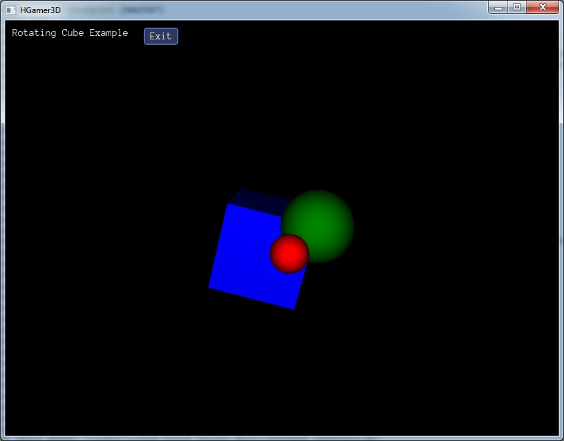
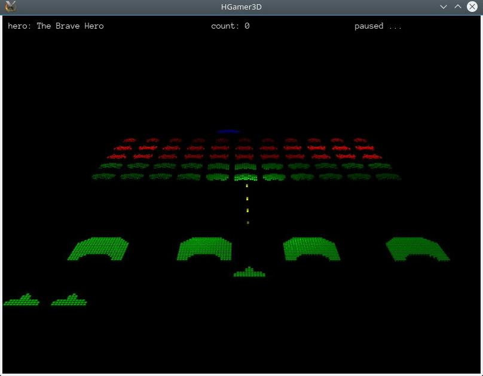
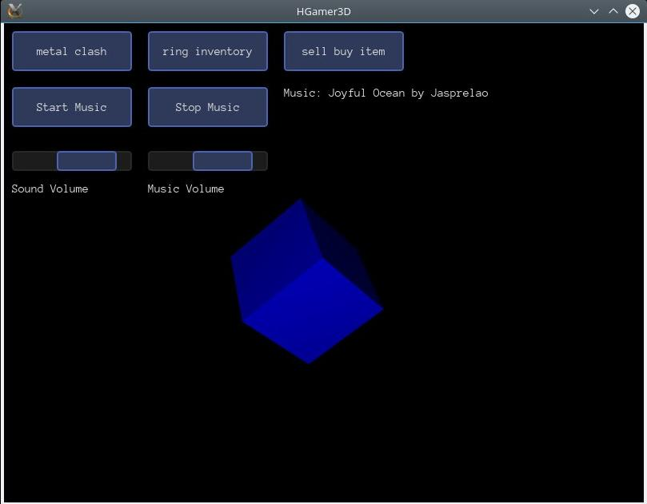

.. _MainIndex:

Create a Game with Haskell
##########################

|

|

Using Haskell - the famous functional programming language - for game creation should be fun and ideally suited to explore functional programming. 

This website and the |HGamer3D| library will help you with that. It is all about simple and fun game programming with Haskell, learning step by step and putting a focus on how to do it. The library is open source and works on Linux, Windows and OS X. I am myself on the road to use this vehicle to get a better grasp of Haskell.

And now, start reading and coding with |HGamer3D|. 

|

**Table of Contents**

.. 	toctree::
	:maxdepth: 1

	Your First Haskell Game <FirstGame>
	Learning Haskell <LearningHaskell>
	Actions and do Notation <Actions>
	API I: Entities <Entities>
	API II: Events <Events>
	API III: 3D Coordinates <Coordinates>
	Tools: Arriccio <Arriccio>
	Game: Cuboid2 <Cuboid2>
	Game: Space Invaders <SpaceInvaders>
	The Scene Graph <SceneGraph>
	Impressum

..
	Tools: Distributing your Game <Distribution>
..

|

If you encounter any issues please send me an e-mail, so I can correct it: uotbw@hgamer3d.org.

.. note:: A big "thank you!" to the creators and maintainers of Haskell, GHC, Urho3D, stack, Textadept, vect and other open source libraries and tools. |HGamer3D| is based on their work. 

News
----
- Sep, 14th - HGamer3D presented at `HAL 2016`_, see `abstract`_ and `slides`_.

.. _`HAL 2016`: http://hal2016.haskell.org
.. _`abstract`: http://hal2016.haskell.org/program.html#althainz-talk
.. _`slides`: http://hal2016.haskell.org/slides/HAL2016-althainz.pdf

.. include:: GeneralInclusions

