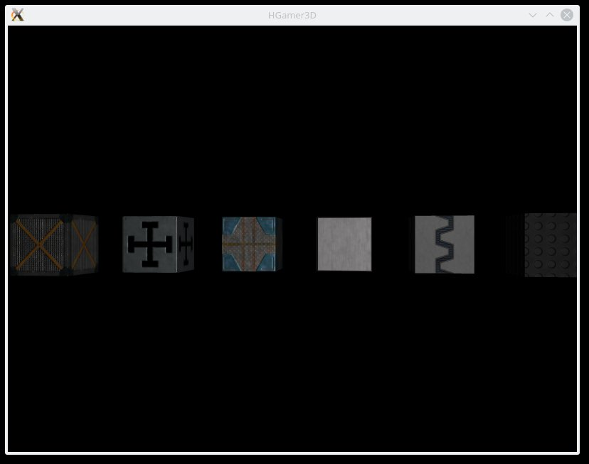

.. _MainIndex:

Create a Game with Haskell
##########################

|

.. image:: images/cuboid2.jpg
   :width: 30%

|

Using Haskell - the famous functional programming language - for game creation should be fun and ideally suited to explore functional programming. 

This website and the |HGamer3D| library will help you with that. It is all about simple and fun game programming with Haskell, learning step by step and putting a focus on how to do it. The library is open source and works on Linux, Windows and OS X. I am myself on the road to use this vehicle to get a better grasp of Haskell.

And now, start reading and coding with |HGamer3D|. 

|

**Table of Contents**

.. 	toctree::
	:maxdepth: 1

	Your First Haskell Game <FirstGame>
	Entities and Events <EntitiesEvents>
	Learning Haskell <LearningHaskell>
	Space Invaders 2D <SpaceInvaders2D>
	The Code - Space Invaders 2D <CodeSpaceInvaders2D>
	Actions and do Notation <Actions>
	Impressum

|

If you encounter any issues please send me an e-mail, so I can correct it: uotbw@hgamer3d.org.

.. note:: A big "thank you!" to the creators and maintainers of Haskell, GHC, Urho3D, stack, Textadept and other open source libraries and tools. |HGamer3D| is based on their work. 

News
----
- 7th June 2016 - fixed regression on aio Windows, please do: "aio update Lua", "aio update Stack" (if no alias set, use full url)
- June 2016 - fixed "CreateProject" on Windows, please do: "aio update CreateProject" (if no alias set, use full url)
- May 2016 - fixed Mouse bug (Windows, Linux), 100%CPU bug (Linux), please do: "aio update Run" (if no alias set, use full url)
- May 2016 - updated "aio" with better error messages, please download version 0.1.2

.. include:: GeneralInclusions

